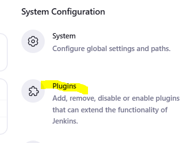
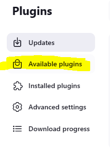
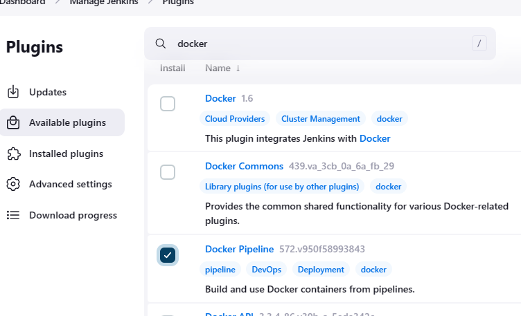
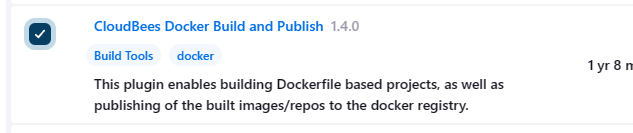

# Install and configure Docker plugins

## Install plugins

1. Go to Manage Jenkins

  

2. Go to plugins

  

3. Available plugins.

  

4. Search for docker and select "Docker Pipeline" and "Cloudbees Docker Build and Publish"

  
  

5. Click Install and wait for Jenkins to complete the install.