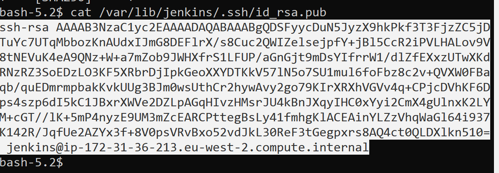
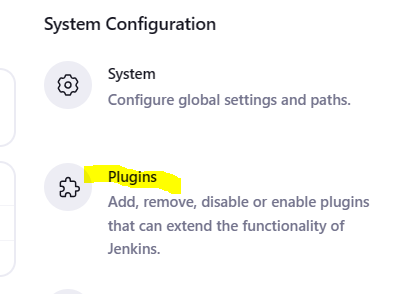
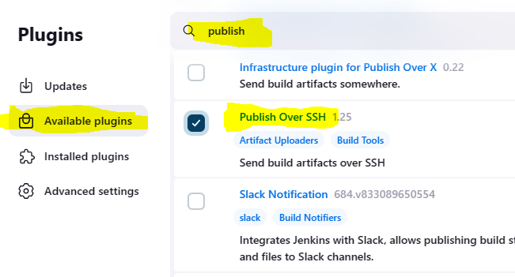
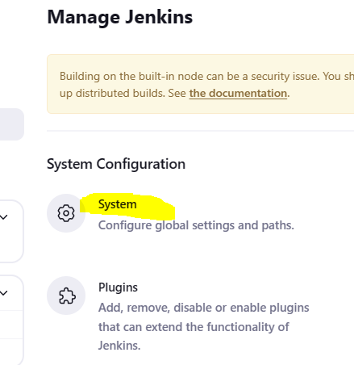
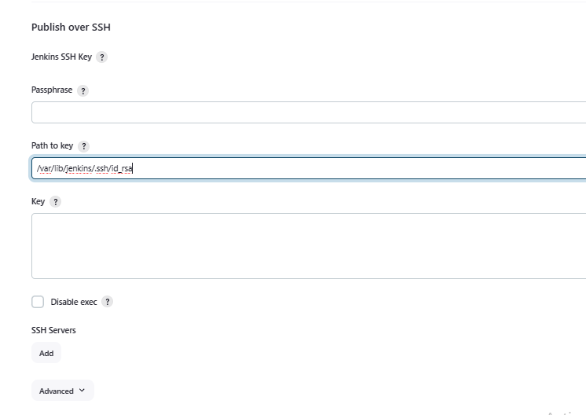
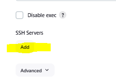
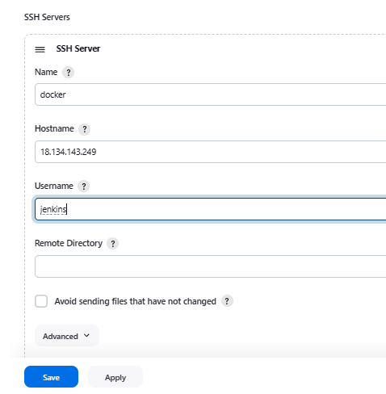

# Connect Jenkins to Docker host

This guide will walk through configuring your jenkins server to be able to connect to the docker host and deploy / run a container.

These instructions will have you switching between the jenkins server and the docker EC2 - pay attention to where you are!

## Configure the docker target EC2

**Run these on the docker EC2, not Jenkins**

1. Log into the **docker** EC2.

2. We need to create a user for the jenkins server to use when connecting to this EC2. This account will need the ability to run docker commands.

3. Execute the following commands.

   ``` sh
   sudo useradd jenkins -m 
   sudo gpasswd docker -a jenkins
   ```

## Configure security between jenkins and docker

1. ssh into the **jenkins server** and then switch to the jenkins user.

   ``` sh
   sudo -u jenkins bash
   ```

2. Create a ssh key in the **PEM** format by using the following commands; accept all defaults.

   ``` sh
   cd /
   ssh-keygen -t rsa -m PEM
   ```
3. Use the cat command to display the public key

   ``` sh
   cat /var/lib/jenkins/.ssh/id_rsa.pub
   ```
4. Copy the key to the clipboard. Select everything including the ssh-rsa to the end of the hostname.

  

5. On the **docker host** make sure you are running as the *jenkins* user.

   ``` sh
   sudo -u jenkins bash
   ```
6. Execute the following commands to navigate to the jenkins user's home folder and create an *authorized_keys* file. Note the spelling of the file name!

   ``` sh
   cd ~
   mkdir .ssh
   chmod 700 .ssh
   cd .ssh
   touch authorized_keys
   chmod 600 authorized_keys
   nano authorized_keys
   ```

7. You should now have an open nano editor, paste the key you copied earlier into this file, then save and exit nano.

## Test connectivity between jenkins and the docker host.

1. On the **jenkins server** type the following to confirm connectivity is working. Replace *18.133.196.52* with the ip address of your docker instance.

   ``` sh
   ssh jenkins@18.133.196.52
   ```

## Install and configure plugins on the Jenkins Server

1. On the jenkins server go into Manage Jenkins.
  
  

2. Select plugins

  

3. On the available plugins search for *publish*, then select *Publish over SSH*

  

4. Install the plugin and wait for jenkins to restart.

5. Go to Manage Jenkins -> System

  

  

6. Scroll down to *Publish over SSH*

  

7. In the *Path to key* section type */var/lib/jenkins/.ssh/id_rsa*

8. Under SSH Servers, click Add.

  

9. Use *docker* for the **name**, *your docker ec2's ip* for **hostname**, and *jenkins* for the **username**

  

10. Your jenkins server should now have permissions to connect to the target docker EC2 and issue commands.